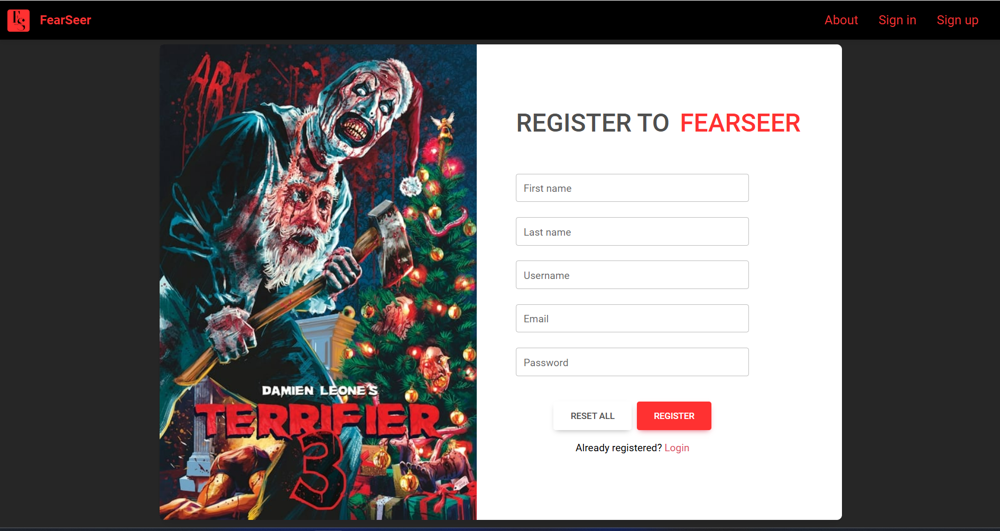
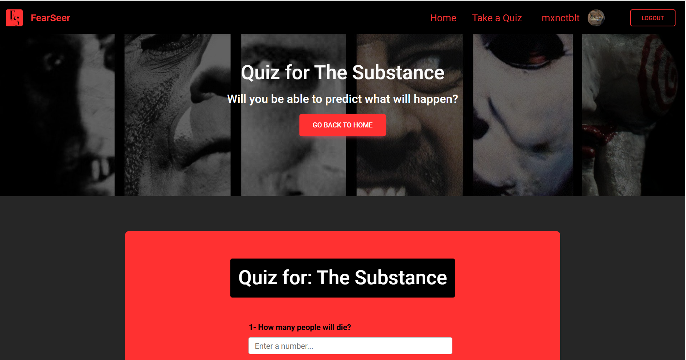

<div align="center">
  
</div>

<h1 align="center">FearSeer</h1>
<h4 align="center">A web app for horror fans.</h4>

<p align="center">
  <a href="#introduction">Introduction</a> •
  <a href="#key-features">Key Features</a> •
  <a href="#installation">Installation</a> •
  <a href="#usage">Usage</a> •
  <a href="#contributing">Contributing</a> •
  <a href="#author">Author</a> •
  <a href="#license">License</a>
</p>

<div class="bg-image mb-5">
    
</div>

## Introduction

To finalize my studies at [Holberton School](https://www.holbertonschool.fr/), I created FearSeer!

> FearSeer (fear + seer) :
>
> > (fear) a distressing emotion aroused by impending danger, evil, pain, etc., whether the threat is real or imagined; the feeling or condition of being afraid.
> >
> > (seer) a person who prophesies future events; prophet:

FearSeer is a Java Spring Boot web application for horror movies fans. As you might have understood by now FearSeer is a fun play on the words fear and seer.

It is a place where friends can bet on what is gonna happen in a horror movie by answering a quick quiz. Once the user finish their film, they can choose to see the answers to the quiz and their scores. This way a user will be able to find out if they truly know horror movies to the point of prediction.

The good news: you don't have to be a horror fanatic to have fun. Anyone can register and play the quiz. On a movie night with friends or by yourself, it doesn't matter. Good luck!

## Key Features

### Registration

As previously stated, to access the Homepage a user will first have to register. Here is a preview of the [registration](./demo/src/main/java/example/demo/registration) form:

<div class="bg-image mb-5">
    
</div>

### User

Once a [user](./demo/src/main/java/example/demo/user) registers, they will be added to the database. Now they are able to login and access the Homepage.

<div class="bg-image mb-5">
    
</div>

### Movies

The Homepage uses the [TMDB API](https://developer.themoviedb.org/reference/intro/getting-started) to show the popular horror [movies](./demo/src/main/java/example/demo/movies) of the moment. There is also the possibility to search for a movie in particular with the search bar.

<div class="bg-image mb-5">
    
</div>

### Quiz

Here come the main feature: the [Quiz](./demo/src/main/java/example/demo/quiz).
User are able to click directly on the button below the posters to take the quiz. A simple ten questions that will tell you if you can predict the future of the characters.

<div class="bg-image mb-5">
    
</div>

### Security

Last but not least, FearSeer uses Spring Security in order to be more protected.
By default, Spring Boot Security enables many security best practices (like CSRF protection, strong password encoding, and HTTPS enforcement).
In addition, the registered users' passwords are encrypted in the database.
All to make FearSeer a [secure](./demo/src/main/java/example/demo/security) app!

## Installation

FearSeer has not yet been deployed but here is how to install it locally.

#### Required:

- [Git](https://git-scm.com/)
- [Java](https://www.java.com/fr/) 17+
- [MySQL](https://www.mysql.com/) 8+
- [Maven](https://maven.apache.org/)

#### Clone this repo:

If the requierements are met you can now clone this repository:

```
$ git clone https://github.com/mxnctblt/FearSeer.git
```

#### Create a database:

With Mysql create a FearSeer database:

```
$ CREATE DATABASE fearseer;
```

Once it is created you will need to connect it to the project. To do so, go to [application.yml](./demo/src/main/resources/application.yml) and put your mysql password in front of password:

> spring:
>
> > database:
> >
> > > password:

## Usage

### With IntelliJ

IntelliJ is a code editor for Java. It simplify the production and you will simply need to go to the file [DemoApplication.java](./demo/src/main/java/example/demo/DemoApplication.java) and from there you will be able to use the button on the top to run FearSeer.
Don't forget to check if all depedencies (in [pom.xml](./demo/pom.xml)) are downloaded.

### Without IntelliJ

#### Build the Application:

Run the following command in the project directory:

```
$ mvn clean install
```

#### Run the JAR File

After the project is packaged, you can run it using the java -jar command.

```
$ java -jar demo-0.0.1-SNAPSHOT.jar.jar
```

#### Run Without Packaging

If you don’t want to package the app and just want to run it from the source:

```
$ mvn spring-boot:run
```

### Running

Now that the server is running go to the website url that you just installed locally.

URL:[http://localhost:8080/](http://localhost:8080/)

## Contributing

This web application uses the following open source packages:

- [Java](https://www.java.com/fr/) 17+
- [MySQL](https://www.mysql.com/) 8+
- [Maven](https://maven.apache.org/)
- [MDB5](https://mdbootstrap.com/)
- [Spring Boot](https://spring.io/projects/spring-boot)

## Author

> Maxence Thibault
>
> > github: [@mxnctblt](https://github.com/mxnctblt)
> > linkedin: [Maxence Thibault](https://www.linkedin.com/in/maxence-thibault/)

## License

© 2024 FearSeer, All Rights Reserved.
